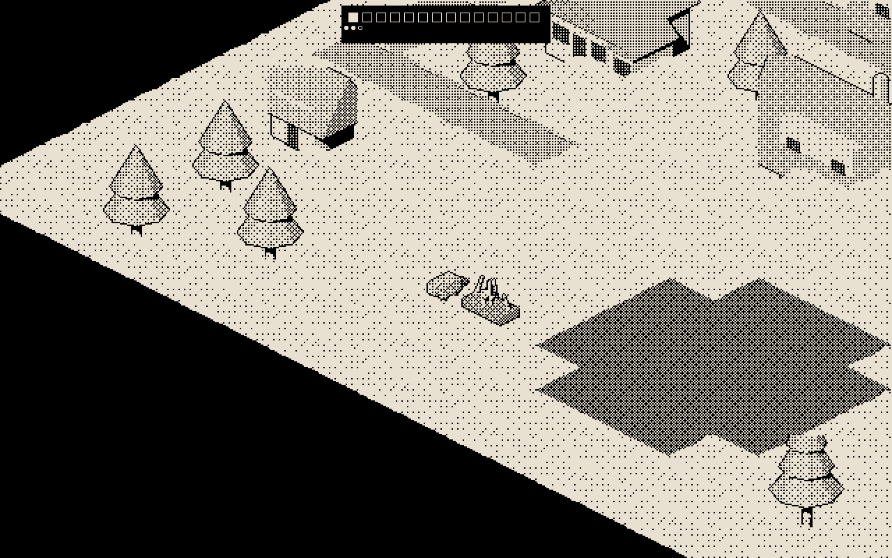

# lofi-beaver

[](https://github.com/ojfbot/lofi-beaver/actions/workflows/ci.yml)

A Glagstone-inspired, **1-bit isometric story-world prototype** of Willow Bend —
a Master Planned Community built on a buried wetland. You are the beaver. The
water remembers. Sibling to [beaverGame](https://github.com/ojfbot/beaverGame)
(the full-scale cozy 3D game); every sprite and ink vignette here is generated
from Blender through the target-side **sprite pipeline** (the brassboard for a
future [asset-foundry](https://github.com/ojfbot/asset-foundry) output modality).



## Play

```bash
pnpm install
pnpm dev          # http://localhost:5180 — WASD walk · click near you to dam
```

- A **season** is 14 days. Dusk comes anyway. The flood resolves nightly
  (the v0-validated BFS core). Story beats fire at dawn; the season ends in
  one of two endings decided by what the watershed actually did.
- Click houses to meet the households. Their lines change once the water
  reaches the crawlspace.

## Mechanics Lab

`?mode=lab` opens the launcher: every mechanic is a composable **dynamic**
(title, clock, flood, dams, pump, beats, residents, heron) with parameter
knobs. Compose weird toys, share the URL, run tabs in parallel
(Wright-style prototyping — ADR-0008). With the clock off, **N** steps a
night.

```
/?mode=lab&dyn=flood,dams&ticks=6        # TOY POND: pure CA sandbox
/?mode=lab&dyn=clock,flood,dams,pump,residents&budget=9&pump=10   # PUMP WARS
```

## The 1-bit invariant

Any gameplay screenshot contains **exactly two RGB values** (paper `#000000`
+ the active ink — day `#e8e0d0`, night `#aebad0`). Sprites are three-state
masks (ink / paper / void); the palette is a `mix-blend-mode: multiply`
overlay; UI is DOM canvases quantized after drawing. CI enforces this with a
real headless browser (`pnpm gate:visual`).

## Regenerating art

```bash
BLENDER_BIN="/Applications/Blender.app/Contents/MacOS/Blender" pnpm sprites
pnpm sprites:validate     # gates: dims, 1-bit purity, coverage, anchor
```

Manifest: `asset-foundry/sprites.yaml`. Camera contract (frozen, Blender
5.1.x): yaw 45°, elevation 30°, ppu 64/√2, canvas-locked Bayer 8×8.

## Development

```bash
pnpm typecheck && pnpm test && pnpm build   # what CI runs
pnpm snap                                    # headless screenshot → tmp/snap.png
pnpm gate:visual                             # the 1-bit gate (after build)
```

Decision history in `decisions/adr/` (0001–0004 = v0 puzzle validator;
0005–0008 = the story-world reboot, sprite pipeline, palette architecture,
Mechanics Lab). Session-continuity beads in `.handoff/`.
